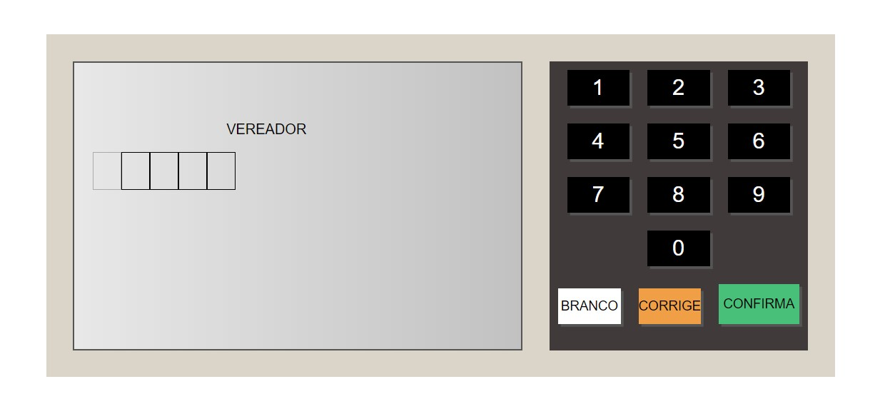
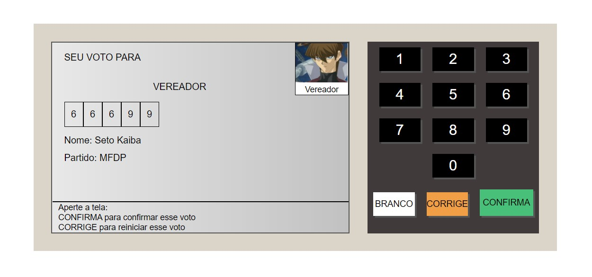
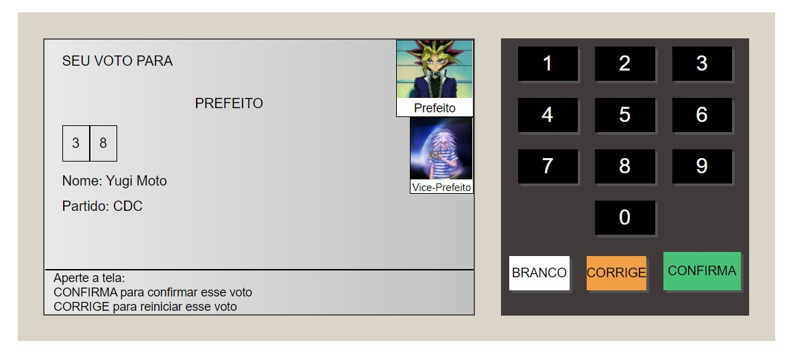

# UrnaWebJs

Nesse projeto foi construido uma versão da urna eleitoral brasileira,  onde foi utilizadas para o desenvolvimentos as tecnologias: 

+ HTML
+ CSS
+ JavaScript

A interface é intuitiva, onde é necessario apenas colocar o número do seu canddiato e após aparecer a foto do mesmo no canto direito, apenas clique em confirmas

#### Interface quando ainda não foi digitado o número

#### Interface quando possui apenas  uma foto

#### Interface quando  possui duas fotos

### Como funciona?

O arquivo possui um documentos chamado etapas.js onde será possivel cadastrar o tipo de votação que você deseja escolhendo desde o tamanho do número do candidato, cargo e até mesmo a quantidade de fotos.

